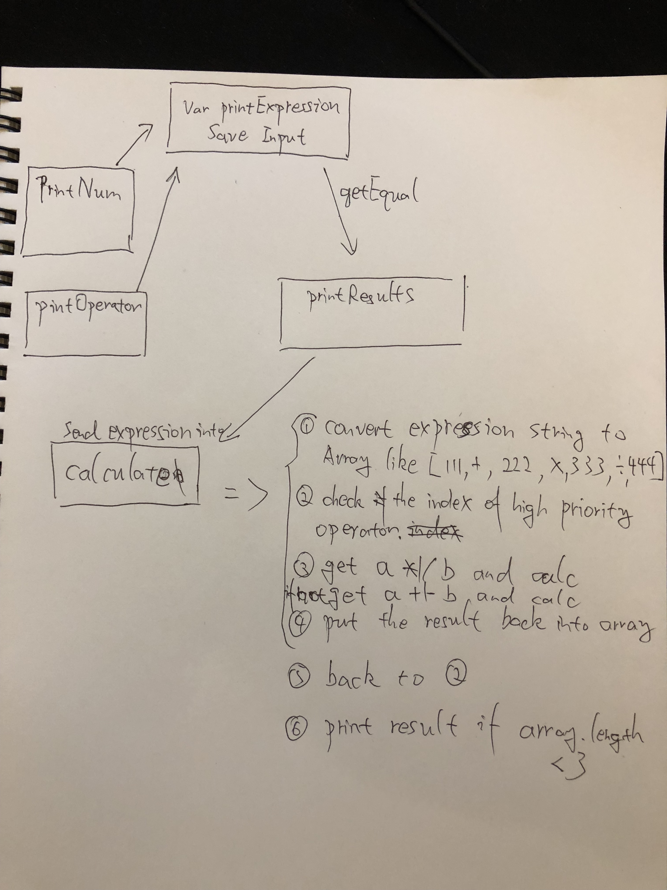

# js-calculator

Todo list:
- code refactor
- After click CE, cannot change operator.
- bug unsolved decimal calculations 0.2 + 0.1 = 0.30000000000000004


### 20 Feb
- Build html page.

### 21 Feb
- Add event listener. Print button innerHTML when clicked.
- Using ```.bind``` to on hold callback function.

### 22 Feb
- Mind map:



- Add ```printNum``` and ```printOperator``` function.
- Find a way to convert expression string into array

```
11+11*11/11 => [11, +, 11, *, 11, /, 11] 
```
- Add ```highPriorityOperatorIndex``` to check the index of first ```*``` or ```/``` if have.

### 23 Feb
- Add ```calcResults``` to handle the expression array and print result.

### 24 Feb
- Print the expression and result on page by click buttons.
- Add function to handle AC button.
- Fix bug when convert expression string to array.
- Add function if click number after click enter refresh the expression print.

### 25 Feb
New IDEA 
```
    expressionStr = "";
    lastChar = expressionStr[expressionStr.length - 1];
    expressionArr = [];
- When click Num:
    check if it's dot. 
    expressionStr += num;
    lastChar = expressionStr[expressionStr.length - 1];

- When click operator:
    check if lastChar match operator 
        if not, push str into expressionArr. 
                push operator into expressionArr.
                empty expressionStr.
                lastChar = operator
```
It works! But code is ugly! need refactor. 

### 26 Feb
- Add CE function
- Add keyboard num and operators input function
- Add negative button in html
- Add negative calc function 
- Add function. When click operator after an operator, change to the current one.
- fix a bug when handle CE 

### 27 Feb 
- refactor printNum function.
- refactor printOperator function.
- Add checkCurrentData function.


Code refactor.
Review all features.
#### I want:
- Click buttons save the input and print num or operator on page.
- Press num or operator button save the input and print them on page.
- Click AC to reset the calculator.
- Click CE to delete the current number.
- Click equal, do the calc and give the result.
- Click negative button to toggle negative symbol
- Click operator, if the last input is operator, change it to the current one.
- Click dot, if no former input or former input is operator, print 0. and save data, else if former input is integer. print . and save data.
- Click 0, if former input is num 1-9 or . print 0 and save data.
- After click equal, when click num, reset the calc and save this num then print on page.


